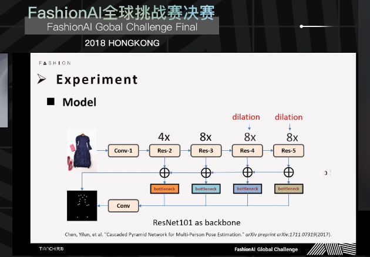
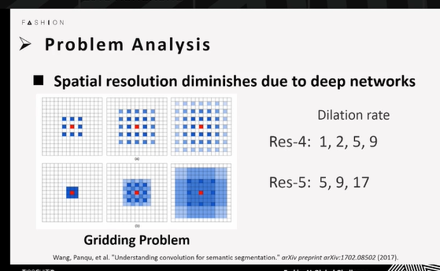
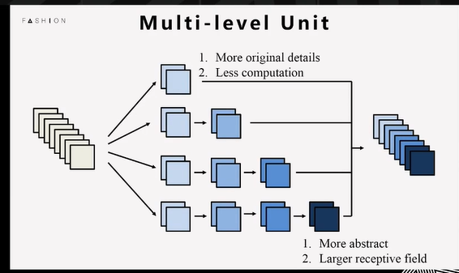

## This repository is my record of attending the [Tianchi FashionAI competition](https://tianchi.aliyun.com/competition/introduction.htm?spm=5176.100067.5678.1.43c15f59deBcQ1&raceId=231648)from March to June this year.It's just for my team and me to record ours thinking and attempts.
 
### At the begining:

*  *1:we have try five models for five category as we thought every category had a 
big gap from each others.*

*  *2:we have thought this is a single object keypoint detection as there is only one
thing in every piture.*

*  *3:we have thought if we want to win,we must have many GPUs and many samples,ps: this is
not wrong but some people can still beat us even under the same resources.*

****So, we have tried a best model in Single Person Pose Estimation,as it is [Learning Feature Pyramids for Human Pose Estimation](
https://arxiv.org/abs/1708.01101),which make sense for me as it's my first reimplement without a good code in github.
That time ,we got err 11.07,leaderboard 19th.****

### Then, we got some improvement, as it is:

*  *1:Thinking it is a Multi Person Pose Estimation question,so wo first got a object detection,like faster rcnn.*

*  *2:Reimplement the 1st model in MPPE,which is* [Cascaded Pyramid Network for Multi-Person Pose Estimation](https://arxiv.org/abs/1711.07319),
*At that time, we got it by ourselves as there is not open code.*

*  *3:There are some tricks like ,for loss design, wo got our OHKM and OHEM loss; for test ,wo got the mean of 11 largest points 
as our final point;for cpn bottleneck,we also using pyrnet bottleneck.*

 

##Extending,At final round,we got some inspires, as :

*  *1:Another loss ,which we think can improve a lot as it solve the disadvantage in heatmap argmax.*

*  *2:Using dilation conv to keep resolution and expand receptive field,and change dilation rate to 
react gridding problem.*

*  *3:Another team show a Multi-level Unit to fight against Resnet Unit,sound interesting but we can not get finetune model using new unit.*

*  *4:The 1st team, show a new model named SHN.*

 

Network Design

Training Process

### In the future, we will implement these one by one.